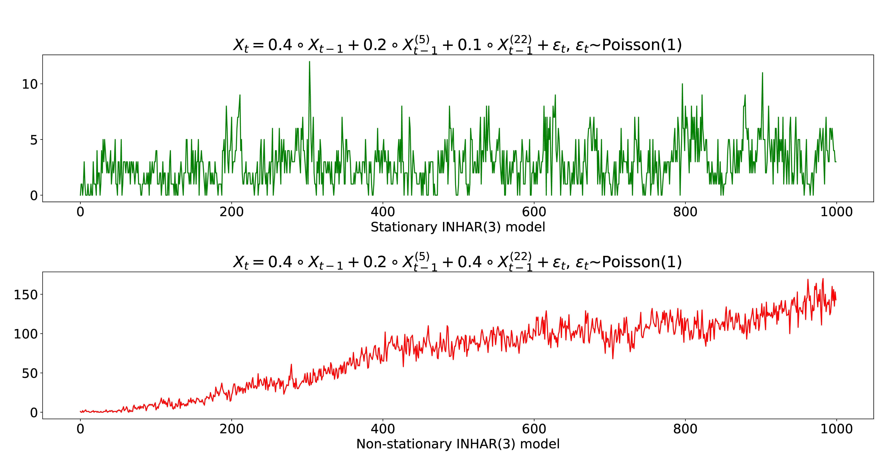

# Integer-Valued HAR($p$) model with Poisson distribution

[Integer-Valued HAR(<i>p</i>) model with Poisson distribution for forecasting IPO volumes (2023)](http://www.csam.or.kr/journal/view.html?doi=10.29220/CSAM.2023.30.3.273)

이질적인 특성을 띄는 음이 아닌 정수형 데이터를 예측하기 위한 모형을 제안한다.  
해당 모형에 대한 코드를 정리한다.

## 목차
1. [모형 정의](#1-모형-정의)
2. [모의 실험](#2-모의-실험)
3. [실증분석 EDA](#3-실증분석-eda)
4. [실증분석 결과](#4-실증분석-결과)

## 1. 모형 정의

`Integer-Valued HAR (INHAR)` 모형은 기존 `Integer-valued AR (INAR)` 모형에 이질적 시장가설 및 장기기억성의 특성을 지닌 `Heterogeneous Autoregression (HAR)` 모형을 접목한 모형이다.

> 참고문헌  
-[McKenzie, E. (1985), SOME SIMPLE MODELS FOR DISCRETE VARIATE TIME SERIES. JAWRA, 21.](https://doi.org/10.1111/j.1752-1688.1985.tb05379.x)  
-[Al-Osh, M., Alzaid, A.A. (1988), Integer-valued moving average (INMA) process. Statistical Papers, 29.](https://doi.org/10.1007/BF02924535)  
-[Corsi, F. (2009), A Simple Approximate Long-Memory Model of Realized Volatility, Journal of Financial Econometrics, 7, 2.](https://doi.org/10.1093/jjfinec/nbp001)

음이 아닌 정수형 데이터 $X_t$에 대해 INHAR 모형은 다음과 같다.

$$
\begin{matrix}
X_t = \alpha_1 \circ X_{t-1}^{(1)} + \alpha_2 \circ X_{t-1}^{(2)} + \cdots + \alpha_p \circ X_{t-1}^{(p)} + \varepsilon_t,\\
X_{t-1}^{(i)} = \frac{1}{h_i}(X_{t-1} + \cdots + X_{t-h_i})
\end{matrix}
$$

여기서 $X_{t-1}^{(i)}$은 시점 $t-1$에서 $h_i$개의 이동평균을 나타내며,  
오차항 $\varepsilon_t$는 모수 $\lambda$를 갖는 포아송 분포를 따른다.

$\circ$ 연산자는 포아송 디닝 (Poisson thinning) 연산자로 비음의 정수값을 가지는 시계열 데이터를 모형화할 수 있다. 수식은 다음과 같다.

$$ \alpha_i \circ X = \sum_{j=1}^{X} N_j, \quad N_j \sim Poi(\alpha_i) $$

INHAR 모형을 코드로 구현하기

````python
"""
    Args:
        hps : [h_1, h_2, ..., h_p]
        phis : [alpha_1, alpha_2, ..., alpha_p, lambda]
"""

def PT(phi,X): # Poisson Thinning 연산자
    Y=np.random.poisson(phi,X)
    L=sum(Y)
    return L

def INHAR_P(hps,phis,n): # hps: h_i의 파라미터, phis: alpha와 lambda 파라미터
    X0=list(np.random.poisson(phis[-1],hps[-1])) # 초기 값 생성
    for t in range(hps[-1],n):
        order,Y=[],[]
        for i in hps:
            globals()['Xt_{}'.format(i)] = int(np.mean(X0[t-i:t])) # h_i개의 이동평균 계산
            order.append(globals()['Xt_{}'.format(i)])
        for i in range(len(hps)):
            Xt=PT(phis[i],order[i]) # alpha와 h_i개의 이동평균을 가지고 X_{t-1}^{(i)} 생성
            Y.append(Xt)
        ram=np.random.poisson(phis[-1]) # 모수 lambda를 가진 오차항 생성
        Y=sum(Y)+ram
        X0.append(Y)
    return X0
````
임의의 모수를 넣어 정상성을 띄는지 확인한다.  
정상성 조건은 $0 \leq \sum \alpha_i < 1$이다.

   

정상성 조건을 만족하지 못한 경우, 계속 증가하는 비정상성을 볼 수 있다.  
이후, 정상성을 만족하는 데이터를 생성하고 모수를 추정한다.

## 2. 모의 실험

모수를 추정하는 방법 중 하나는 `조건부 최소제곱(Conditional least squares; CLS)` 추정량을 이용한다.  
모수 벡터 $\theta = ( \alpha_1, \dots, \alpha_p, \lambda)^{\top}$를 추정하는 과정은 다음과 같다.  

시점 $t-1$까지의 정보를 $\cal{F}_{t-1}$라고 할 때, $X_t$의 조건부 평균은 다음과 같다.  

$$ E(X_t|F_{t-1})=\alpha_1 X_{t-1}^{(1)} + \cdots +\alpha_p X_{t-1}^{(p)}+\lambda $$

$X_t$와 조건부 평균의 차이를 $Q_n(\theta)$라고 했을 때,

$$
\begin{equation}
Q_n(\theta) = \sum^n_{t=1}(X_t -\alpha_1 X_{t-1}^{(1)} - \cdots  -\alpha_p X_{t-1}^{(p)}-\lambda)^2
\end{equation}
$$

$Q_n(\theta)$의 값을 최소화하는 모수 $\theta$가 CLS 추정량이다. 계산하는 식은 다음과 같다.

$$
\begin{equation}
\hat \theta_{CLS} =( \hat \alpha_{1,CLS}, \dots, \hat \alpha_{p,CLS}, \,\hat \lambda _{CLS})^{\top} = \mathbb{X}^{-1}\mathbb{Y}
\end{equation}
$$

$$
\mathbb{Y}= \left(\sum^n_{t=1}X_t X_{t-1}^{(1)}, \dots,  \sum^n_{t=1}X_t X_{t-1}^{(p)}, \sum^n_{t=1}X_t  \right)^{\top}
$$

$$
\mathbb{X}=  \left[
\begin{array}{lllll}
\sum\limits_{t=1}(X_{t-1}^{(1)})^2 & \sum\limits_{t=1}X_{t-1}^{(2)}X_{t-1}^{(1)} & \cdots & \sum\limits_{t=1}X_{t-1}^{(p)}X_{t-1}^{(1)} & \sum\limits_{t=1}X_{t-1}^{(1)} \\
\sum\limits_{t=1}X_{t-1}^{(1)}X_{t-1}^{(2)} & \sum\limits_{t=1}(X_{t-1}^{(2)})^2 & \cdots & \sum\limits_{t=1}X_{t-1}^{(p)}X_{t-1}^{(2)} & \sum\limits_{t=1}X_{t-1}^{(2)} \\
\vdots && \ddots && \vdots \\ 
\sum\limits_{t=1}X_{t-1}^{(1)}X_{t-1}^{(p)} & \sum\limits_{t=1}X_{t-1}^{(2)}X_{t-1}^{(p)} & \cdots & \sum\limits_{t=1}(X_{t-1}^{(p)})^2 & \sum\limits_{t=1}X_{t-1}^{(p)} \\
\sum\limits_{t=1}X_{t-1}^{(1)} & \sum\limits_{t=1}X_{t-1}^{(2)} & \cdots & \sum\limits_{t=1}X_{t-1}^{(p)} & n \\
\end{array}
\right]
$$

CLSE 코드

```python
def CLSE(XX,hps):
    nn,n=len(XX),len(hps)
    for i in range(n+1):
        globals()['b_'+str(i)] = 0
    A=np.zeros((n+1,n+1))
    for t in range(nn-hps[-1]):
        Xt=XX[t+hps[-1]]
        Xtt=[]
        for i in hps:
            globals()['Xt_'+str(i)] = int(np.mean(XX[t+hps[-1]-i : t+hps[-1]]))
            Xtt.append(globals()['Xt_'+str(i)])
        Xtt.append(1)
        for i in range(n+1):
            globals()['b_'+str(i)] = globals()['b_'+str(i)] + Xt*Xtt[i]
            for j in range(n+1):
                A[i,j]=A[i,j]+Xtt[i]*Xtt[j]
    b=[]
    for i in range(n+1):
        b.append(globals()['b_'+str(i)])
    A_inv=np.linalg.inv(A)
    return np.matmul(A_inv,b)
```

임의의 모수를 가진 INHAR 모형을 따르는 데이터에 대해 CLS 추정 결과는 다음과 같다.

<table>
    <thead>
        <tr>
            <th>Model</th>
            <th>Parameter</th>
            <th>Bias(s.e.)</th>
        </tr>
    </thead>
    <tbody>
        <tr>
            <td rowspan=3>$h_p$=(1,7)</td>
            <td>$\alpha_1=0.4$</td>
            <td>-0.0007(0.0011)</td>
        </tr>
        <tr>
            <td>$\alpha_2=0.25$</td>
            <td>-0.0092(0.0017)</td>
        </tr>
        <tr>
            <td>$\lambda=1$</td>
            <td> &nbsp 0.0219(0.0033)</td>
        </tr>
        <tr>
            <td rowspan=4>$h_p$=(1,7,14)</td>
            <td>$\alpha_1=0.15$</td>
            <td>-0.0062(0.0012)</td>
        </tr>
        <tr>
            <td>$\alpha_2=0.12$</td>
            <td>-0.0007(0.0026)</td>
        <tr>
            <td>$\alpha_3=0.1$</td>
            <td>-0.0162(0.0030)</td>
        </tr>
            <td>$\lambda=1$</td>
            <td> &nbsp 0.0236(0.0028)</td>
        </tr>
    </tbody>
</table>

이후, 실증분석을 위해 실제 데이터를 적용한다.  
금융 변동성에서의 이질적 시장 가설을 따르는 정수형 데이터인 국내 기업공개(IPO) 데이터를 이용한다.

## 3. 실증분석 EDA

데이터 출처는 국내 기업공시채널 [KIND(Korea investor’s network for disclosure system)](https://kind.krx.co.kr)이며,  
2000년 1월부터 2022년 7월까지의 월별 국내 기업공개(IPO) 수를 분석한다. 아래는 월별 IPO의 그래프이다.

   

데이터의 특징과 정상성을 알아보기 위해 기술통계량 및 ADF 검정을 한다. 결과는 다음과 같다.

| n | Mean | Median | Maximum | Minimum | Std   | Skewness | Kurtosis | ADF Statistic | ADF p-value |
| --- | --- | --- | --- | --- | --- | --- | --- | --- | --- |
| 271 | 6.830 | 6.000 | 39.000 | 0.000 | 6.104 | 1.985 | 5.408 | -2.914 | 0.044 |

월별 데이터임을 고려하여 시차 모수 $h_p$는 (1,12), (1,6,12)로 선택한다.

## 4. 실증분석 결과

2000년 1월부터 2020년 12월까지 252개의 데이터를 In-sample로  
2021년 1월부터 2022년 7월까지의 데이터를 Out-of-sample로 하여 분석한다.  
예측평가 지표로 MAE, RMSE, MAPE, SMAPE, RRSE를 이용하며, 한단계 예측을 시행한다.  

시차 모수 $h_p$=(1,12)와 (1,6,12)에 대한 INHAR 모형 적합 결과는 다음과 같다. 

   

<table>
    <thead>
        <tr>
            <th>Model</th>
            <th>Parameter</th>
            <th>coef.(s.e.)</th>
        </tr>
    </thead>
    <tbody>
        <tr>
            <td rowspan=3>$h_p$=(1,12)</td>
            <td>$\alpha_1$</td>
            <td>0.3225(0.0617)</td>
        </tr>
        <tr>
            <td>$\alpha_2$</td>
            <td>0.4392(0.1056)</td>
        </tr>
        <tr>
            <td>$\lambda$</td>
            <td>1.6492(0.6555)</td>
        </tr>
        <tr>
            <td rowspan=4>$h_p$=(1,6,12)</td>
            <td>$\alpha_1$</td>
            <td>0.3069(0.0667)</td>
        </tr>
        <tr>
            <td>$\alpha_2$</td>
            <td>0.1141(0.1840)</td>
        <tr>
            <td>$\alpha_3$</td>
            <td>0.3442(0.1862)</td>
        </tr>
            <td>$\lambda$</td>
            <td>1.6411(0.6564)</td>
        </tr>
    </tbody>
</table>

추정된 모수로 한 단계 예측 분석을 한 후, 기존 INAR 모형을 이용한 분석 결과와 비교한다.  
신뢰구간은 95%이며, 결과는 다음과 같다.

   


| | MAE | RMSE | MAPE | SMAPE | RRSE |
| --- | --- | --- | --- | --- | --- |
| **INHAR(2)** | 2.4699 | 2.9643 | 39.1116 | 16.5429 | 1.108 |
| **INAR(2)** | 2.7350 | 3.1520 | 40.7012 | 18.4818 | 1.1781 |
||
| **INHAR(3)** | 2.4897 | 2.9743 | 39.1858 | 16.7153 | 1.1117 |
| **INAR(3)** | 2.8006 | 3.1744 | 41.3265 | 18.8416 | 1.1865 |


비교 분석 결과, 기존 모형보다 효율이 증가한 것을 확인할 수 있다.


